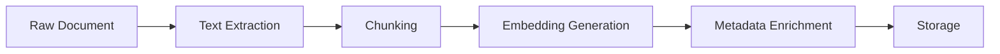
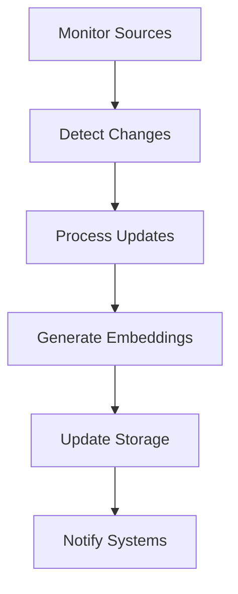

# Cardano MCP Server Knowledge Base

## Overview

The Knowledge Base component of the Cardano MCP Server is responsible for storing, managing, and retrieving Cardano-related documentation, code examples, and best practices. It uses vector embeddings for semantic search and efficient information retrieval.

## Architecture

### Components

```
knowledge-base/
├── store/           # Storage implementations
├── embeddings/      # Vector embedding generation
├── retrieval/       # Search and retrieval logic
└── processors/      # Document processing pipelines
```

## Data Organization

### 1. Documentation Structure

```
documentation/
├── core-concepts/
│   ├── consensus/
│   ├── eutxo-model/
│   └── networking/
├── smart-contracts/
│   ├── plutus/
│   ├── marlowe/
│   └── patterns/
├── tokens/
│   ├── native-tokens/
│   ├── nft/
│   └── metadata/
└── development/
    ├── tools/
    ├── frameworks/
    └── testing/
```

### 2. Code Examples

```
code-examples/
├── smart-contracts/
│   ├── basic/
│   ├── intermediate/
│   └── advanced/
├── frontend/
│   ├── react/
│   ├── vue/
│   └── angular/
└── tools/
    ├── cli/
    ├── sdk/
    └── testing/
```

### 3. Best Practices

```
best-practices/
├── security/
├── performance/
├── testing/
└── deployment/
```

## Vector Storage

### 1. Schema

```sql
CREATE TABLE knowledge_vectors (
  id TEXT PRIMARY KEY,
  content TEXT NOT NULL,
  embedding vector(1536),
  metadata JSONB,
  created_at TIMESTAMP DEFAULT CURRENT_TIMESTAMP,
  updated_at TIMESTAMP DEFAULT CURRENT_TIMESTAMP
);

CREATE INDEX knowledge_vectors_embedding_idx ON knowledge_vectors
USING ivfflat (embedding vector_cosine_ops)
WITH (lists = 100);
```

### 2. Metadata Structure

```json
{
  "type": "documentation|code|best-practice",
  "category": "smart-contracts",
  "subcategory": "plutus",
  "tags": ["security", "optimization"],
  "source": {
    "url": "https://docs.cardano.org/...",
    "version": "1.0.0",
    "lastUpdated": "2024-03-04T12:00:00Z"
  }
}
```

## Document Processing

### 1. Processing Pipeline



### 2. Chunking Strategy

- Maximum chunk size: 512 tokens
- Overlap: 50 tokens
- Preserve semantic boundaries
- Maintain context links

### 3. Embedding Generation

```typescript
interface EmbeddingConfig {
  model: 'openai' | 'local';
  dimensions: number;
  batchSize: number;
}

interface EmbeddingResult {
  vector: number[];
  metadata: {
    tokens: number;
    processingTime: number;
  };
}
```

## Retrieval System

### 1. Search Interface

```typescript
interface SearchParams {
  query: string;
  filters?: {
    category?: string[];
    type?: string[];
    tags?: string[];
  };
  limit?: number;
  minRelevance?: number;
}

interface SearchResult {
  content: string;
  relevance: number;
  metadata: Record<string, any>;
  context: {
    before: string[];
    after: string[];
  };
}
```

### 2. Relevance Scoring

```typescript
interface RelevanceScore {
  vectorSimilarity: number;
  keywordMatch: number;
  recency: number;
  popularity: number;
  finalScore: number;
}
```

### 3. Context Assembly

```typescript
interface ContextAssembly {
  mainContent: SearchResult[];
  relatedContent: SearchResult[];
  codeExamples: SearchResult[];
  bestPractices: SearchResult[];
}
```

## Maintenance

### 1. Update Process



### 2. Quality Control

- Regular validation of content
- Broken link checking
- Embedding quality assessment
- Relevance testing

### 3. Performance Monitoring

```typescript
interface PerformanceMetrics {
  averageQueryTime: number;
  cacheHitRate: number;
  embeddingGenerationTime: number;
  storageUtilization: number;
}
```

## Integration

### 1. API Endpoints

```typescript
class KnowledgeBaseAPI {
  async search(params: SearchParams): Promise<SearchResult[]>;
  async getDocument(id: string): Promise<Document>;
  async suggest(context: string): Promise<Suggestion[]>;
  async update(document: Document): Promise<void>;
}
```

### 2. Event System

```typescript
interface KnowledgeBaseEvent {
  type: 'update' | 'delete' | 'error';
  payload: any;
  timestamp: Date;
}
```

### 3. Caching Strategy

```typescript
interface CacheConfig {
  ttl: number;
  maxSize: number;
  strategy: 'lru' | 'lfu';
}
```

## Security

### 1. Access Control

- Role-based access for updates
- Read-only public access
- Audit logging

### 2. Data Validation

- Content sanitization
- Metadata validation
- Source verification

### 3. Rate Limiting

```typescript
interface RateLimits {
  search: {
    requestsPerMinute: number;
    tokensPerDay: number;
  };
  update: {
    requestsPerHour: number;
    documentsPerDay: number;
  };
}
```

## Backup and Recovery

### 1. Backup Strategy

- Daily full backups
- Hourly incremental backups
- Vector store snapshots

### 2. Recovery Procedures

- Point-in-time recovery
- Embedding regeneration
- Metadata reconstruction

## Monitoring

### 1. Health Checks

```typescript
interface HealthCheck {
  storage: boolean;
  embeddings: boolean;
  search: boolean;
  cache: boolean;
}
```

### 2. Alerts

- Storage capacity
- Query performance
- Update failures
- Security events
